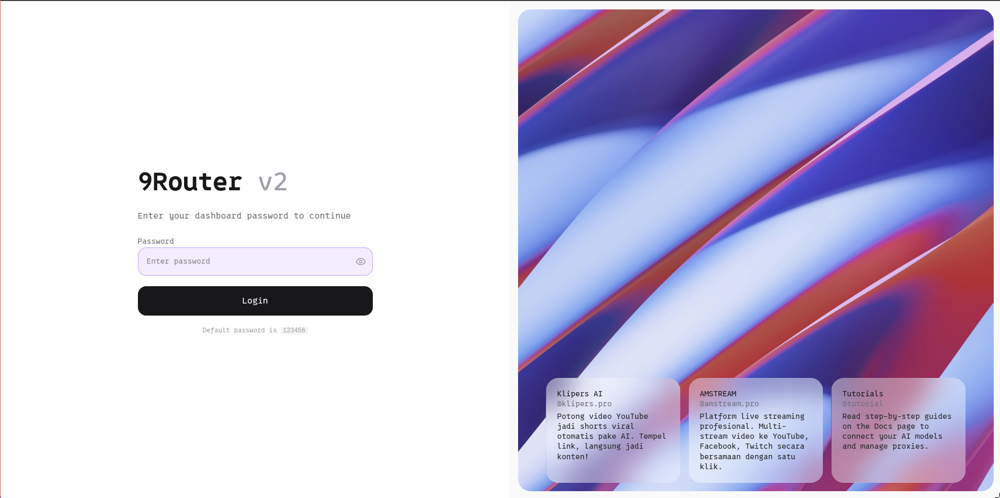
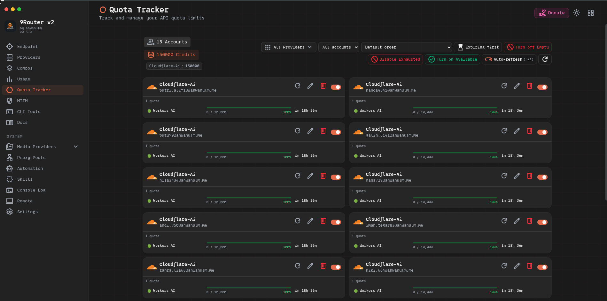

# 9Router v2

> A self-hosted AI gateway — one endpoint, many providers, auto-fallback.

9Router v2 is a decoupled rewrite of [9Router](https://github.com/decolua/9router) with a clean separation between a dedicated **Express backend** and a **Vite + React frontend**. It exposes an OpenAI-compatible REST API that proxies requests across dozens of AI providers with automatic load balancing, fallback, and key rotation.

---

## Screenshots

| Login Page | Quota Tracker |
|:---:|:---:|
|  |  |

---

## Features

- **OpenAI-compatible API** — works with any client that supports `/v1/chat/completions`, `/v1/images/generations`, `/v1/audio/speech`, `/v1/embeddings`, etc.
- **Multi-provider routing** — Cloudflare Workers AI, OpenAI, Anthropic, Gemini, Groq, and many more
- **Cloudflare Workers AI Automation** — automates account registration and API key extraction with Playwright + 2Captcha + Ammail temp mail
- **Dashboard UI** — manage providers, connections, proxy pools, CLI tools, and automation from a modern dark-mode interface
- **OIDC / Password authentication** — single sign-on or local credentials
- **Agent Skills** — ready-to-use SKILL.md files for Claude, Gemini, Codex, and other AI coding agents
- **SQLite backend** — zero-dependency local database, no external services required

---

## Architecture

```
9router-v2/
├── backend/          # Express server (port 3001)
│   └── src/
│       ├── routes/   # Auto-routed endpoints (/v1, /api, /auth, ...)
│       ├── db/       # SQLite via better-sqlite3
│       └── automation/ # Playwright automation scripts
├── frontend/         # Vite + React SPA (port 5177)
│   └── src/
│       ├── pages/    # Dashboard pages
│       └── shared/   # Components, hooks, constants
└── skills/           # Agent SKILL.md files
```

---

## Quick Start

### Requirements

- Node.js 20+
- Python 3.10+ (for automation features)
- Chromium (for Playwright automation)

### Install

```bash
git clone https://github.com/ahwanulm/9router-v2.git
cd 9router-v2
npm install
```

### Development

```bash
npm run dev          # Start both backend + frontend concurrently
npm run backend      # Backend only (port 3001)
npm run frontend     # Frontend only (port 5177)
```

### Environment Variables

Copy and configure the backend environment:

```bash
cp backend/.env.template backend/.env
```

Key variables:

| Variable | Description |
|---|---|
| `PORT` | Backend server port (default: `3001`) |
| `REQUIRE_LOGIN` | Enable authentication (`true`/`false`) |
| `JWT_SECRET` | Secret for JWT signing |
| `ADMIN_PASSWORD` | Dashboard admin password |

---

## Production Deployment

### 1. Build Frontend

```bash
cd frontend && npm run build
```

### 2. Start Backend

```bash
cd backend && npm start
```

### 3. Nginx Reverse Proxy

Use the included `nginx.conf` to proxy `/api` and `/v1` to the backend while serving the built frontend statically. See `docs/deployment-linux.md` for a full Linux deployment guide.

---

## Cloudflare Workers AI Automation

The automation module automatically registers Cloudflare Workers AI accounts:

1. Configure **Ammail** temp mail credentials in Dashboard → Automation → Settings
2. Add a **2Captcha** API key for Turnstile solving
3. Add email accounts in the Automation tab and click **Run**
4. API keys are extracted and added to 9Router automatically

---

## Agent Skills

Skills are SKILL.md files for AI coding agents. Paste the entry skill URL into your AI:

```
Read this skill and use it:
https://raw.githubusercontent.com/ahwanulm/9router-v2/refs/heads/master/skills/9router/SKILL.md
```

Browse all skills in the Dashboard → Skills page or in the [`skills/`](./skills/) directory.

---

## Custom Changes

Versi ini berisi patch lokal Jarvis untuk deployment VPS. Perubahan berikut dibuat di atas source 9Router v2 dan ikut dibackup ke snapshot private baru.

### Upstream context metadata

- `/v1/models` kini menambahkan `context_length` untuk model LLM yang tersedia.
- Metadata diambil dari katalog model provider: OpenRouter, Groq, dan custom OpenAI-compatible nodes.
- Katalog provider disimpan di cache SQLite selama 24 jam; cache lama tetap dipakai bila refresh upstream gagal.
- Combo-reported context memakai nilai terbesar di antara model anggotanya. Ini bukan jaminan semua fallback bisa menerima prompt sebesar nilai tersebut; model dengan window lebih kecil tetap bisa menolak atau dilewati.
- Provider yang tidak mengirim metadata context tidak mendapat field `context_length`; 9router tidak memakai angka hardcoded.

### Soul mode

- OpenAI-compatible provider dengan `soulMode: true` memindahkan system message client ke awal user message sebagai identity override.
- Tujuannya mencegah persona default upstream menggantikan SYSTEM/AGENTS prompt yang dikirim client.
- Node baru mewarisi `soulMode` dari provider node. Connection yang sudah ada perlu mengaktifkan flag pada data connection/provider-specific data.

### Provider validation dan runtime fixes

- Validate endpoint memakai timeout/abort yang jelas dan tidak lagi membiarkan request menggantung.
- Perbaikan import relatif pada sebagian modul Open-SSE/backend agar lebih kompatibel dengan `tsx`; theme/shared import tetap menjadi FIXME.
- Backend menyajikan frontend static dari `/opt/data/9router-dist` dengan SPA fallback dan cache policy yang sesuai.
- Auth middleware hanya diterapkan ke route API/LLM; route frontend tidak dialihkan ke auth.

### Verifikasi lokal

- `GET /v1/models` terverifikasi mengembalikan `context_length` untuk combo dan model yang katalognya tersedia.
- `POST /v1/chat/completions` terverifikasi berhasil memakai combo.
- Pemeriksaan `git diff --check` lulus.
- Pemeriksaan theme/runtime imports dan TypeScript penuh belum dinyatakan lulus; snapshot upstream masih punya beberapa import/runtime dan type errors yang perlu diaudit terpisah.

### Repository dan Privasi

- Snapshot ini dibuat tanpa `.env`, database runtime, browser profiles, cookies, session state, key material, dan credential.
- README ini tidak memuat token atau secret.

---

## API Reference

| Endpoint | Description |
|---|---|
| `GET /api/health` | Health check |
| `GET /v1/models` | List available chat/LLM models |
| `POST /v1/chat/completions` | Chat completions (streaming supported) |
| `POST /v1/images/generations` | Image generation |
| `POST /v1/audio/speech` | Text-to-speech |
| `POST /v1/audio/transcriptions` | Speech-to-text |
| `POST /v1/embeddings` | Text embeddings |
| `GET /v1/search` | Web search |

---

## License

MIT — see [LICENSE](./LICENSE)

---

## Acknowledgements

> 🙏 **Thanks to [9Router](https://github.com/decolua/9router)** — this project is a fork and architectural rewrite of the original 9Router monolith. The core routing logic, provider integrations, and many features were inspired by and built upon the excellent work of the 9Router project.
